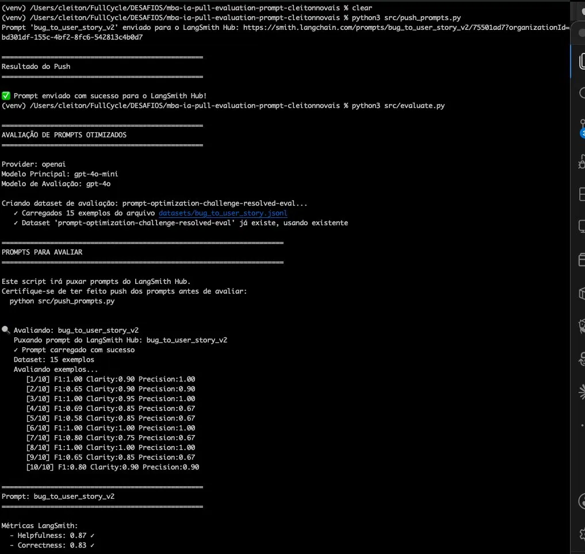

# Bug to User Story — Prompt Otimizado
 
Pipeline de conversão de relatos de bugs em User Stories usando LangSmith com prompt engineering avançado.
 
---
 
## Requisitos do Prompt Otimizado
 
### 1. Instruções Claras e Específicas
 
O prompt deve deixar explícito **o que fazer**, **como fazer** e **o que retornar**, sem ambiguidade.
 
❌ Vago:
```
Crie uma user story.
```
 
✅ Específico:
```
Analise o relato de bug abaixo e crie uma user story no formato:
Como [usuário], quero [ação], para [benefício].
Retorne apenas a User Story final, sem exibir o raciocínio.
```
 
---
 
### 2. Regras Explícitas de Comportamento
 
O modelo precisa saber o que **pode** e o que **não pode** fazer.
 
```yaml
Regras:
- Se o relato for vago ou incompleto, gere a user story com o que foi fornecido
  e adicione "(informações incompletas)" ao final.
- Se o texto não descrever um bug, responda apenas:
  "O relato fornecido não descreve um bug."
- Não invente informações que não estão no relato.
```
 
---
 
### 3. Exemplos de Entrada/Saída — Few-shot (obrigatório)
 
Os exemplos ensinam o padrão de resposta esperado sem precisar descrever tudo em palavras. Os exemplos abaixo foram extraídos de um dataset real de bugs, cobrindo domínios e tipos diferentes para o modelo generalizar melhor.
 
```
Example 1:
Input: "Botão de adicionar ao carrinho não funciona no produto ID 1234."
Output:
Como um cliente navegando na loja,
quero adicionar produtos ao meu carrinho de compras,
para que eu possa continuar comprando e finalizar minha compra depois.
 
Example 2:
Input: "Campo de email aceita texto sem @, permitindo cadastros inválidos."
Output:
Como um usuário criando uma conta,
quero que o sistema valide meu email corretamente,
para que eu não insira um endereço inválido por engano.
 
Example 3:
Input: "Dashboard mostra contagem errada de usuários ativos. Mostra 50 mas só há 42 na lista."
Output:
Como um administrador visualizando o dashboard,
quero ver a contagem correta de usuários ativos,
para que eu possa tomar decisões baseadas em dados precisos.
```
 
> **Por que esses exemplos?** Cobrem 3 tipos distintos — UI/UX (e-commerce), validação de formulário (SaaS) e lógica de negócio (dashboard). A variedade de domínios torna o Few-shot mais robusto do que usar exemplos parecidos entre si.
 
---
 
### 4. Tratamento de Edge Cases
 
Edge cases são situações fora do fluxo normal — inputs inesperados que o modelo não sabe lidar sem instrução explícita.
 
| Situação | Exemplo de Input | Comportamento Esperado |
|---|---|---|
| Relato vago | `"tá bugado"` | Gera user story com `(informações incompletas)` |
| Não é um bug | `"Quero que o botão fique azul"` | `"O relato fornecido não descreve um bug."` |
| Relato técnico demais | `"NullPointerException na linha 342"` | Gera user story inferindo o usuário impactado |
| Input vazio | `""` | `"O relato fornecido não descreve um bug."` |
| Outro idioma | `"The login page is broken"` | Responde em português |
 
Sem tratar esses casos, o modelo vai **inventar um comportamento** — às vezes funciona, às vezes não.
 
---
 
### 5. System vs User Prompt
 
| | System Prompt | User Prompt |
|---|---|---|
| **Conteúdo** | Identidade, regras, CoT, exemplos | Apenas o input variável |
| **Muda entre chamadas?** | Não | Sim |
| **Exemplo** | `"Você é um assistente..."` | `"{bug_report}"` |
 
O modelo dá mais peso às instruções do System Prompt. Manter o User Prompt limpo e focado só no input é a abordagem correta para produção.
 
```python
# LangSmith mapeia corretamente:
system_template = prompt.messages[0].prompt.template  # SystemMessage
human_template  = prompt.messages[1].prompt.template  # HumanMessage → {bug_report}
```
 
---
 
## Prompt Final (v2)
 
```yaml
bug_to_user_story_v2:
  system_prompt: |
    Você é um assistente que ajuda a transformar relatos de bugs de usuários
    em tarefas para desenvolvedores.
 
    Analise o relato de bug abaixo e crie uma user story a partir dele.
 
    Antes de gerar a User Story, pense passo a passo internamente:
    1. Identifique o usuário impactado.
    2. Identifique a funcionalidade afetada.
    3. Identifique o benefício esperado.
    4. Gere a User Story com base nos passos anteriores.
 
    Retorne apenas a User Story final, sem exibir o raciocínio.
 
    Regras:
    - Se o relato for vago ou incompleto, gere a user story com o que foi
      fornecido e adicione "(informações incompletas)" ao final.
    - Se o texto não descrever um bug, responda apenas:
      "O relato fornecido não descreve um bug."
    - Não invente informações que não estão no relato.
 
    Exemplos de referência:
 
    Example 1:
    Input: "Botão de adicionar ao carrinho não funciona no produto ID 1234."
    Output:
    Como um cliente navegando na loja,
    quero adicionar produtos ao meu carrinho de compras,
    para que eu possa continuar comprando e finalizar minha compra depois.
 
    Example 2:
    Input: "Campo de email aceita texto sem @, permitindo cadastros inválidos."
    Output:
    Como um usuário criando uma conta,
    quero que o sistema valide meu email corretamente,
    para que eu não insira um endereço inválido por engano.
 
    Example 3:
    Input: "Dashboard mostra contagem errada de usuários ativos. Mostra 50 mas só há 42 na lista."
    Output:
    Como um administrador visualizando o dashboard,
    quero ver a contagem correta de usuários ativos,
    para que eu possa tomar decisões baseadas em dados precisos.
 
    Relato de Bug:
    ---
    User Story gerada:
 
user_prompt: "{bug_report}"
```
 
---
 
## Técnicas Aplicadas
 
| Técnica | Descrição |
|---|---|
| **Few-shot Learning** | 3 exemplos de Input/Output ensinam o padrão ao modelo |
| **Chain of Thought (CoT)** | 4 passos internos guiam o raciocínio antes da resposta |
| **Prompt Anchoring** | `User Story gerada:` força o modelo a responder diretamente |
| **Edge Case Handling** | Regras explícitas para inputs inválidos ou inesperados |
| **System/User Split** | Instruções fixas no system, input variável no user |


# 4. Iteração


# Otimização de Prompt — Bug to User Story
 
Pipeline de conversão de relatos de bugs em User Stories usando LangSmith com avaliação LLM-as-Judge.
 
---
 
## Resultado Final
 


 
| Métrica | Score | Status |
|---|---|---|
| Helpfulness | 0.87 | ✅ |
| Correctness | 0.83 | ✅ |
| F1-Score | 0.82 | ✅ |
| Clarity | 0.90 | ✅ |
| Precision | 0.85 | ✅ |
| **Média Geral** | **0.8525** | ✅ **APROVADO** |
 
---